1.  Create [[Github]{.underline}](https://github.com/) account\
    

2.  Download and install
    [[https://desktop.github.com/]{.underline}](https://desktop.github.com/)\
    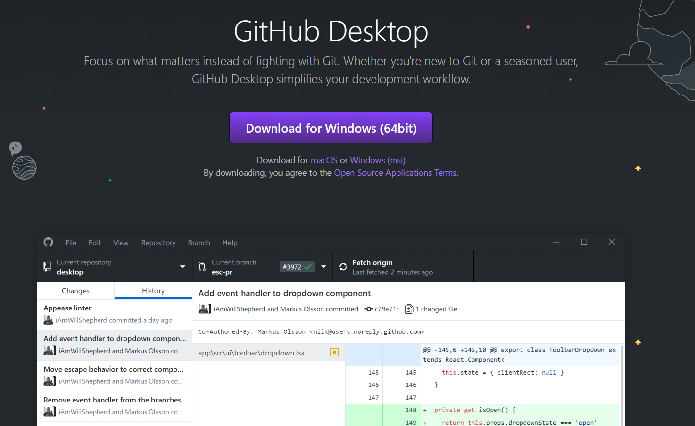

3.  Create a *repo* 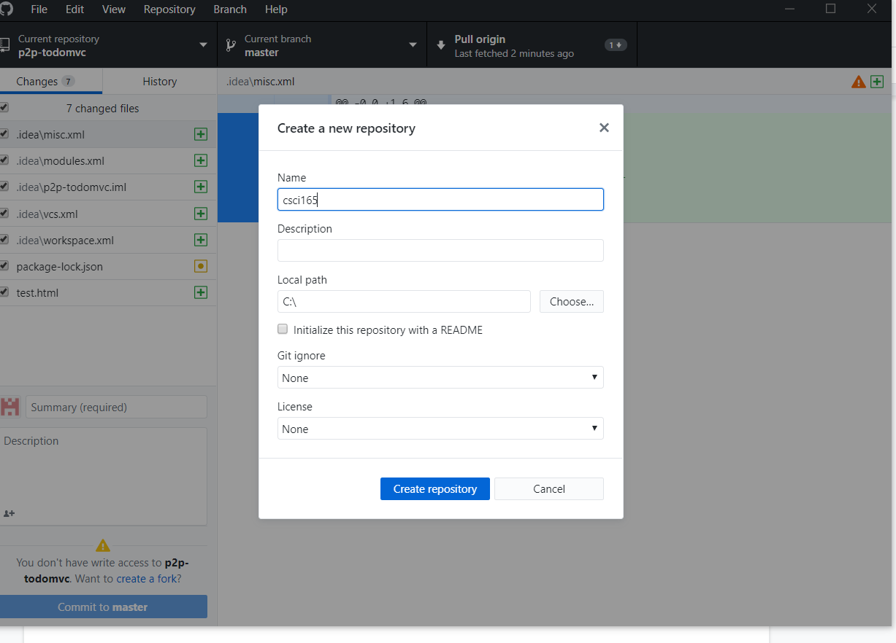{width="6.5in"
    height="4.666666666666667in"}

4.  Create *index.html* inside the home directory of your
    repo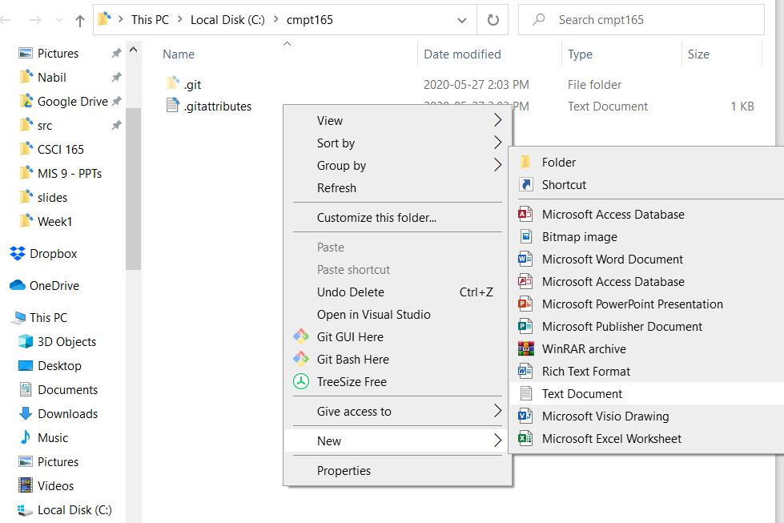{width="6.5in"
    height="4.333333333333333in"}

5.  Open *index.html* and fill with this content

> \<html\>
>
> \<head\>
>
> \<title\>Home\</title\>
>
> \</head\>
>
> \<body\>
>
> Hi, this is my first website.
>
> \</body\>
>
> \</html\>

6.  Save the file.

7.  Commit and Push in GitHub Desktop

8.  Review your changes in Github.com

9.  Create
    [[https://app.netlify.com/]{.underline}](https://app.netlify.com/)
    account and link it to your GitHub
    account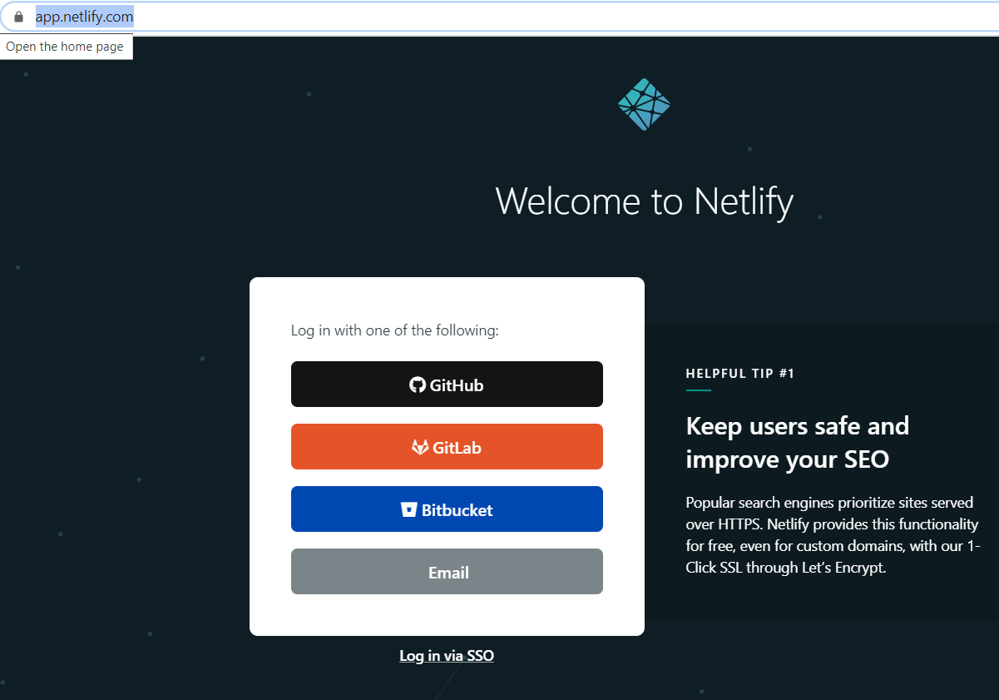

10. Create a new site in Netlify 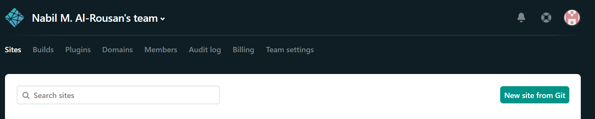

11. Link Netlify site to GitHub
    repo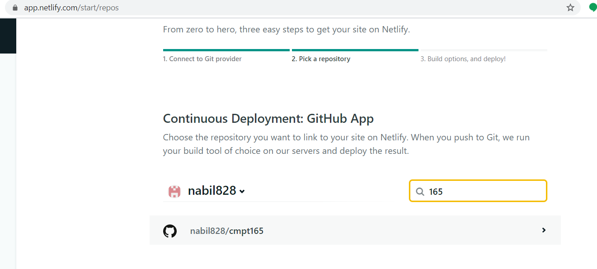

12. Deploy!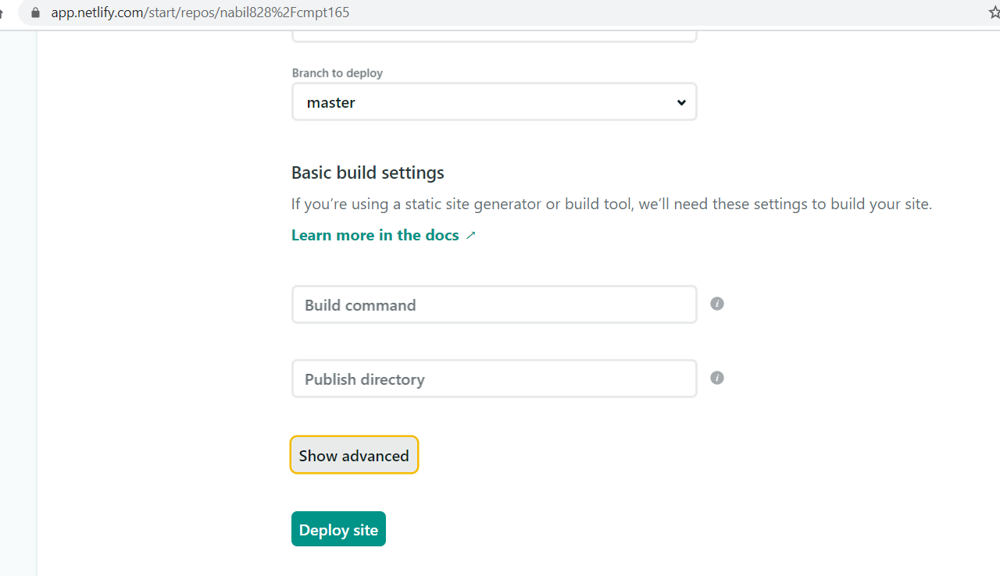

13. Wait a few seconds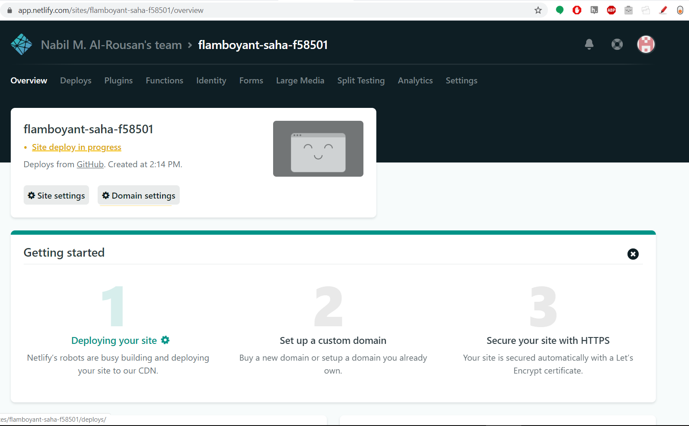

14. Voilà .. deployed!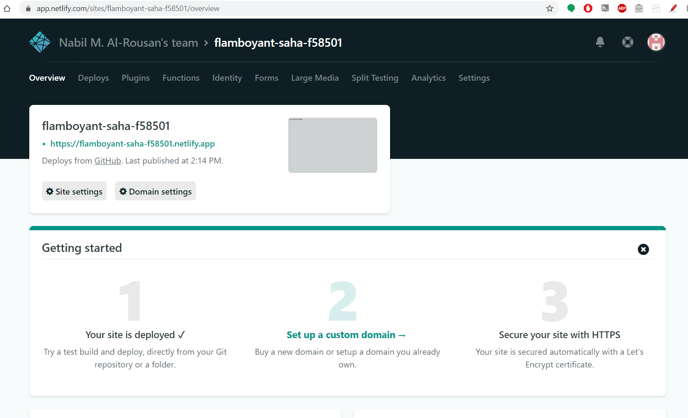

> 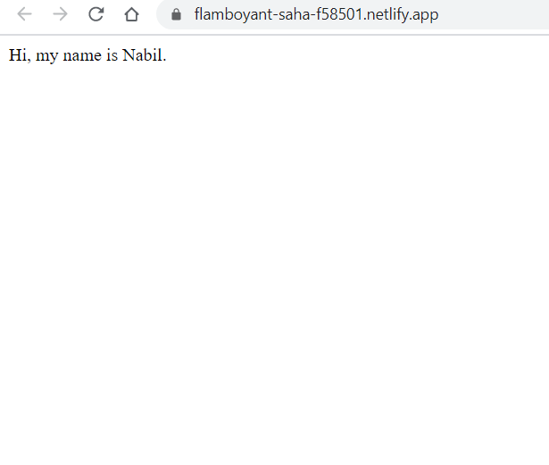
>
> 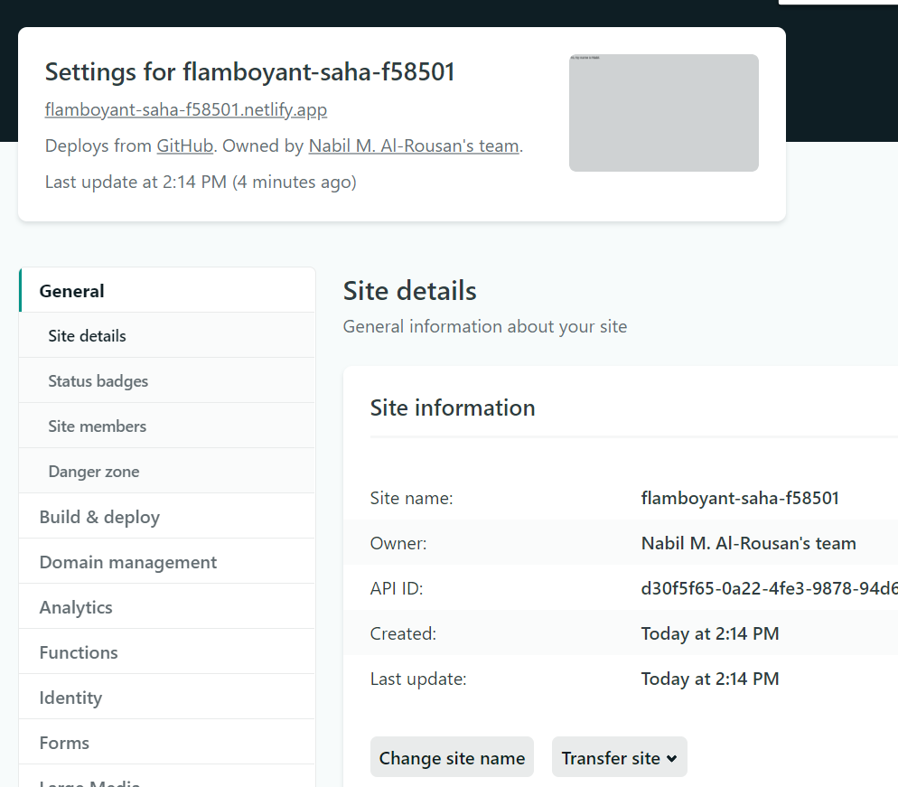
>
> Phew! That is it!
